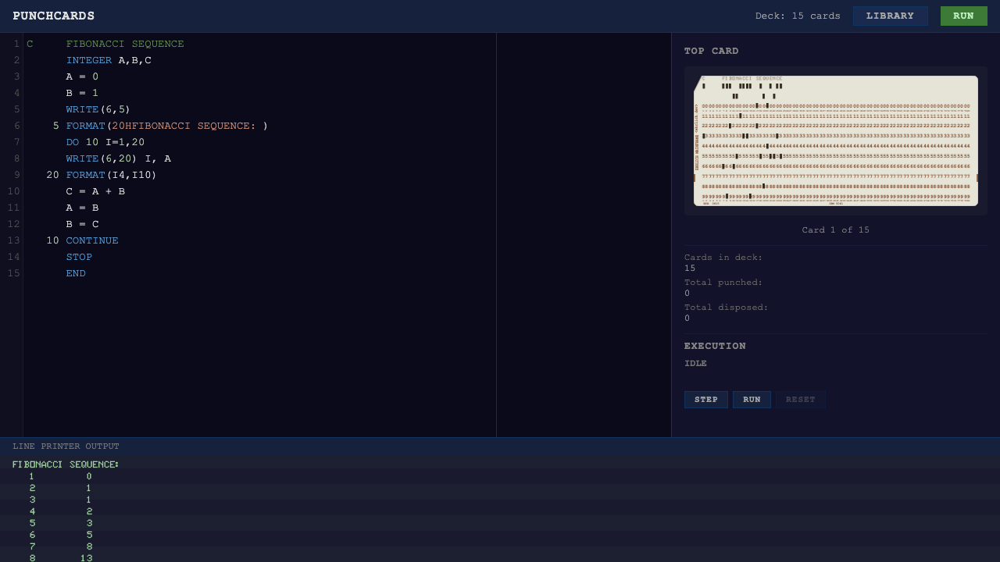

# Punchcards

A browser-based IBM punch card simulator with a working FORTRAN IV interpreter. Type code, watch cards get punched in real-time, and run programs on a simulated IBM System/360.

**Live:** [punch.ehrlich.dev](https://punch.ehrlich.dev)




## Features

- **Punch card renderer** -- canvas-based IBM 5081 cards with Hollerith encoding, chamfered corners, print strip, and column/row markings
- **Code editor** -- CodeMirror with FORTRAN IV syntax highlighting and column 72 guide
- **Real-time punching** -- cards update as you type, with hole animations and dirty-card tracking
- **FORTRAN IV interpreter** -- expressions, DO loops, IF/GOTO, arithmetic IF, arrays, relational and logical operators
- **Stepping debugger** -- step through execution one statement at a time
- **Line printer output** -- green-bar paper aesthetic with dot-matrix font
- **Program library** -- example programs: Hello World, Fibonacci, Temperature Table, FizzBuzz, and more
- **Card viewer** -- click any card to inspect it full-size with column detail on hover
- **Recycle bin** -- disposed cards are saved for inspection
- **Persistence** -- auto-saves to localStorage, restores on reload

## Tech

Pure HTML, CSS, and JS. No frameworks, no build step, no npm. Single `index.html` plus `fortran.js` for the interpreter. Hosted as a static site.

## Run locally

```
python3 -m http.server 8029
```

Then open [http://localhost:8029](http://localhost:8029).

## FORTRAN IV support

The interpreter implements a subset of FORTRAN IV (FORTRAN 66) as it ran on the IBM System/360:

| Feature | Status |
|---|---|
| WRITE / FORMAT | Done |
| Hollerith constants, quoted strings | Done |
| Iw, Fw.d, Ew.d, wX, repeat counts | Done |
| INTEGER / REAL / implicit typing | Done |
| Assignments, expressions (+, -, *, /, **) | Done |
| DO loops / CONTINUE | Done |
| Logical IF, arithmetic IF, GOTO | Done |
| .GT. .LT. .EQ. .NE. .GE. .LE. | Done |
| .AND. .OR. .NOT. | Done |
| DIMENSION (arrays) | Done |
| READ (card reader input) | Done |
| SUBROUTINE / FUNCTION | Planned |
| COMMON / DATA | Planned |
